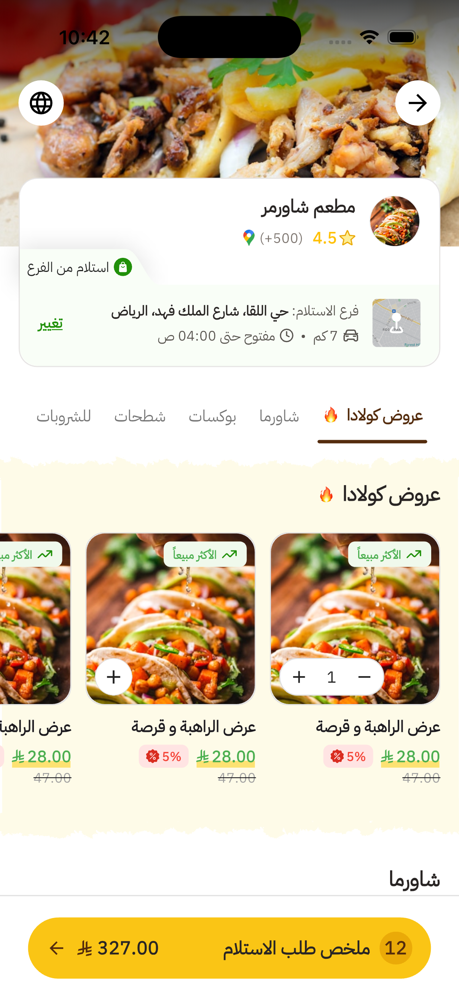
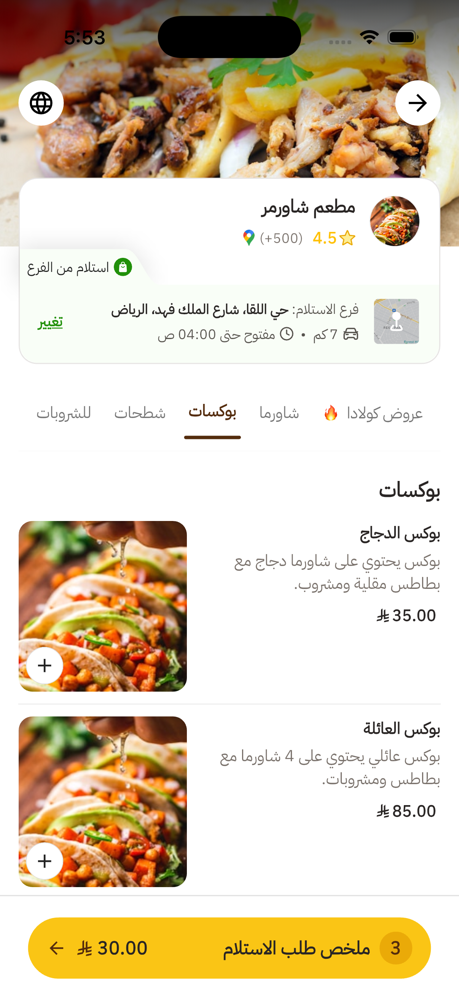
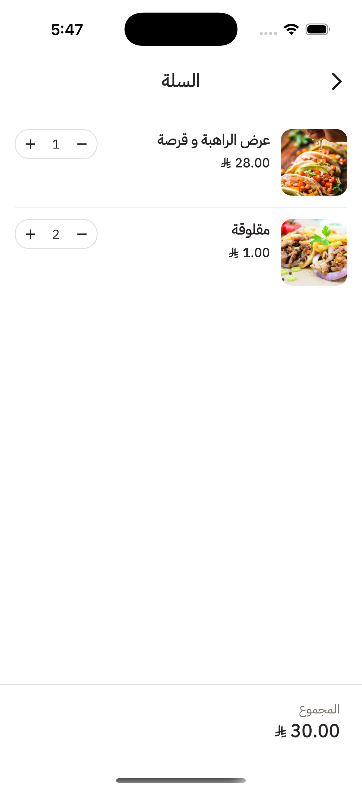

# 🍽️ Colada Restaurant Menu App

A Flutter Developer Assessment for Colada, implementing a pixel-perfect Restaurant Profile & Menu Page based on Figma design.

---

## 📝 Overview

This app showcases a restaurant’s profile and menu, featuring a sticky header, category tabs, menu sections (offers & items), and a cart bar. It’s built for technical evaluation, focusing on clean architecture, robust state management, and API integration.

---

## ✨ Features

- Sticky header with restaurant info
- Horizontal, scrollable category tabs with active state
- Menu sections: Offers (grid or list, as clarified) & regular items
- Cart bottom bar with item count and total
- Pixel-perfect UI matching Figma design
- RTL (Arabic) support
- LTR (English) support
- Language change button (switch between Arabic and English)
- Cart button navigates to a dedicated cart screen

---

## 🏗️ Architecture

- **Clean Architecture**: Divided into data, domain, and presentation layers
- Modular structure for scalability and maintainability
- Clear separation of concerns

---

## 🔄 State Management

- **Riverpod** with annotation-based code generation
- Simple, explicit states: initial, loading, success, error, empty
- Providers for menu and cart logic

---

## 🌐 API Integration

- RESTful API integration
- Base URL: `https://backend.coladaapp.io/public/assessment`
- Endpoints:
	- `/venue/venue_shawarmer_01`
	- `/venue/venue_shawarmer_01/catalog`
- Error handling for network and data issues

---

## 🚀 How to Run

1. Clone the repo
2. Run `flutter pub get`
3. Launch with `flutter run`
4. For RTL: set device language to Arabic

---

## 🗒️ Notes

- Offers section layout (grid/list) was clarified and implemented accordingly
- All UI elements are custom widgets for reusability
- Proper error and empty state handling
- Fully supports both LTR and RTL layouts
- Clean, production-ready code with clear folder structure
- Language can be changed at runtime using the language button
- Tapping the cart button navigates to the cart screen

---

## 📁 Additional Project Structure

- `lib/config`: App config, dependency injection, routing, theming, use cases
- `lib/core`: Constants, error handling, networking (Dio), shimmers, base state
- `lib/features/menu`: All menu-related logic, split into data, domain, and presentation
	- Data: API models, remote data source, repository implementation
	- Domain: Entities, repository interface, use cases
	- Presentation: Providers, screens, widgets (header, tabs, cart, etc.)

---

---

## 📸 Screenshots

	
	
	

---

---

## 🎬 Demo Video

<video src="assets/images/demo.mp4" controls width="320"></video>

---

[Download the latest APK](./apk/app-release.apk)

---

Thank you for reviewing this assessment! 🚀